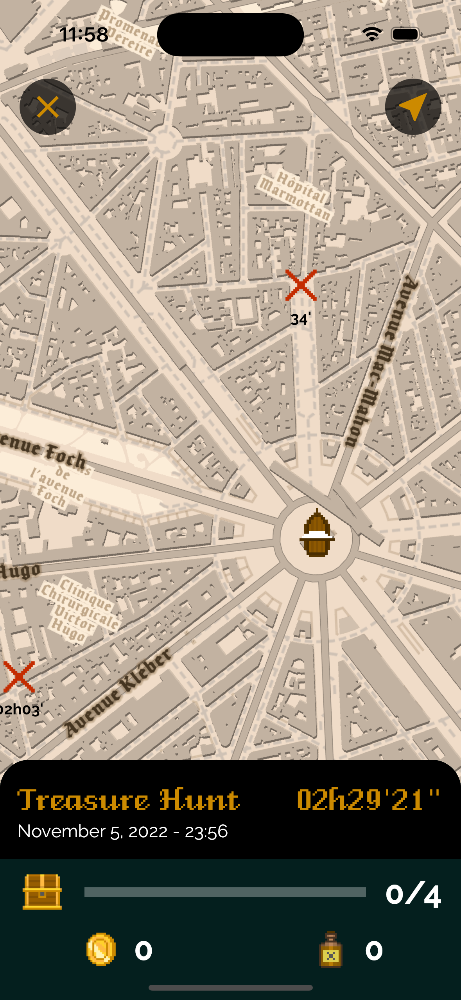

# Seven Seas

**Seven Seas** is a Web3 treasure hunt Game-Fi adventure involving Move-and-Earn mechanics.

Players buy pirates NFTs to build their crew and go hunting for treasures of Pirate Gold tokens (PGLD) located all arround them.

Pirate Gold tokens can then be used to buy ships, improve threir crew, or can be cashed out at anytime for profit.

The game is available as a smartphone app on iOS and Android.

  &nbsp;

## Intended audience

Eventhough, **Seven Seas** is a Web3 game, the app was designed to make it almost invisible to the players with features such as social login support (Google, Apple, and Discord are supported), in-app purchase, and network fees subsidies (so that players don't need to get to an exchange to buy cryptocurrency).

?> Note: advanced Web3 players can also login by providing their own seed phrase.

## Mission

**Seven Seas** is a game, and does not pretend to save the world, fight the climate change or serve any higher purpose.

The goals of the game are simple and clear:
1. Have fun
2. Be challenging
3. Earn money

Note that earning money comes third. For a simple reason: the game needs to be sustainable. Which means:
- A balanced model instead of unsustainable ROI promises
- An affordable entry cost and less financial pressure on newcomers
- Fair fees

Finally, the game also aims at becoming a game onwed by its contributors and its players, through its PGLD token.

  

